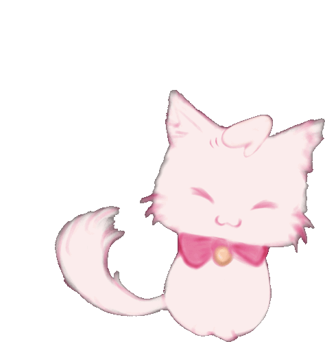

PS07
================

### Section: 01 Stoddard

``` r
library(tidyverse)
library(babynames)

Nikki_name <- babynames %>% 
  filter(name == "Nikki")
```

``` r
ggplot(Nikki_name, aes(x = year, y = n, color = sex)) +
  geom_line() +
  labs(title= "Gender Distribution of Name 'Nikki'", subtitle = "From 1925 to 2017", x= "Year", y= "Count", color= "Gender") +
  scale_color_manual(values = c("#ff5c7e", "#af5cff"))
```

<!-- -->

<figure>
<figcaption aria-hidden="true">Kitty_gif</figcaption>
</figure>


*J.R.R. Tolkien once said:*

> “All that is gold does not glitter, not all those who wander are lost;
> the old that is strong does not wither, deep roots are not reached by
> the frost.

> From the ashes a fire shall be woken, a light from the shadows shall
> spring; renewed shall be blade that was broken, the crownless again
> shall be king.”
